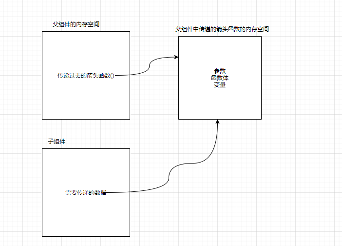

# react中的插槽的实现

在vue中,当我们想让自己的组件更具有通用性的时候,通常会使用插槽`slot`的语法,留出自定义的内容,例如很多页面中都会应用的nav组件,但是因为页面的不同,所需要显示的内容也不同,这个时候,我们通常会使用插槽,让开发者根据需要去传递不同的dom

但是在react中,官方并没有提供这样的元素,我们想要实现类似于插槽的功能的时候,就需要我们自己实现了

这里给出几种很容易想到的插槽实现方法

## 方法一:通过children实现插槽

直接将元素作为组件的children写入

这里的元素会被放入到props里的children

每个组件都能获取到props.children,它包含了组件的开始标签和结束标签之间的内容

```jsx
//父组件
<TabControl>
 {/* 这里的三个span会被依次放入TabControl的props里的children里面 */}
  <span>左边</span>	
  <span>中间</span>
  <span>右边</span>
</TabControl>
```

```jsx
render() {
    const { children } = this.props
    return (
      <div className='tab-control'>
        <div className='left'>{children[0]}</div>
        <div className='center'>{children[1]}</div>
        <div className='right'>{children[2]}</div>
      </div>
    )
  }
```

**注意**:当组件的开始标签与结束标签中的内容有多个元素的时候,props.children是一个数组,依次存放这些内容,但是当只有一个元素的时候,props.children就不再是数组了,而就是这个元素

```jsx
<TabControl>
 {/* 这里的三个span会被依次放入TabControl的props里的children里面 */}
  <span>只有我一个啦</span>	
</TabControl>
```

```jsx
render() {
    const { children } = this.props
    return (
      <div className='tab-control'>
        <div className='left'>{children}</div>
      </div>
    )
  }
```


当然,实际开发中我们很少这样去用,因为这种方式有两个个无法避免的弊端

1. 需要通过propTypes对children做类型限制,以获得我们希望的类型,例如上面的例子中,当我们期望获得一个数组来依次渲染的时候,父组件只传入了一个元素,这个时候,页面就不是我们想要的效果了
2. 当传入多个元素的时候,对顺序有严格的要求,因为我们是通过下标的方式去获取元素的,这就意味着我们必须知道每个下标对应的元素是什么,同时也需要使用者知道我们是按照什么顺序去渲染的,从而按照我们期望的顺序传递


## 方式二:通过props实现插槽

通过上面的例子,我们知道,props中有一个专门的变量用来存储开始标签与结束标签之间的内容,那么我们能不能将组件或者元素直接通过props传递给子组件呢

答案是可以的

```jsx
//父组件
render() {
  const leftContent = <button>左边</button>
  const centerContent = <span>中间的内容</span>
  const rightContent = <u>右边</u>
  return (
  <div>
    <TabControl 
      leftSlot={leftContent} 
      centerSlot={centerContent} 
      rightSlot={rightContent}/>
   </div>
  )
 }
```

```jsx
//子组件
render() {
    const { leftSlot, centerSlot, rightSlot } = this.props
    return (
      <div className='tab-control'>
        <div className="lefr">{leftSlot}</div>
        <div className="center">{centerSlot}</div>
        <div className="right">{rightSlot}</div>
      </div>
    )
  }
```


# react中实现作用域插槽

在实现作用域插槽之前,我们需要了解作用域插槽是做什么用的,有什么功能

简单来说,当父组件使用插槽的时候,仍然想使用子组件中的值,作为自己传递过去的元素中渲染的内容的时候,这个时候,就需要我们使用作用域插槽了

例如,我们在父组件中使用插槽,给子组件传递了一个`span`元素,但是span标签中的内容,并不想在父组件中写死,而是由子组件决定

想要在react中实现作用域插槽,就需要对父子组件之间的通信有一定的理解

之前,我们学习过子组件将值传递给父组件,是通过函数调用的方式,将值作为父组件传递过来的函数的入参,再传递出去

那么,作用域插槽同样用到了这个技巧

```jsx
//父组件
return (
      <div>
        <TabControl titles={titles} tabClick={index => {this.changeIndex(index)}} Slot={item => <button>{item}</button>}/>
      </div>
    )
//Slot是要传递给子组件的元素,但是与之前的不同的是,这里是通过传递了一个箭头函数,将button元素作为返回值传递给了子组件
```

我们再来看看子组件是怎么处理的

```jsx
render() {
    const { titles, Slot } = this.props //首先拿到父组件传递过来的函数
    const { currentIndex } = this.state
    return (
      <div className='tab-control'>
        {titles.map( (title,index) => {
          return (
            <div className={`tab-item`} onClick={e => this.itemClick(index)}>
              { Slot(title) } //在这里通过函数调用的方式,拿到函数的返回值,也就是button元素,将子组件中的title作为入参,传递给了父组件
            </div>
          )
        })}
      </div>
    )
  }
```

这样,我们就实现了作用域插槽

其实要充分了解react中的子传父,需要对函数有一定的了解

简单理解,当定义的了一个函数的时候,浏览器会在内存中开辟一块空间,单独存放函数中的变量,参数等内容,而react中的子传父,就相当于利用的这个特性,将需要传递值,先存放在了函数的空间内



# Context的应用场景

Context提供了一种在组件之间共享此类值的方式,而不必显示的通过组件树的逐层传递props

Context的设计目的是为了共享那些对于一个组件树而言是"全局"的数据

由于有redux,所以Context并不常用,想要了解,可以去官网看一下